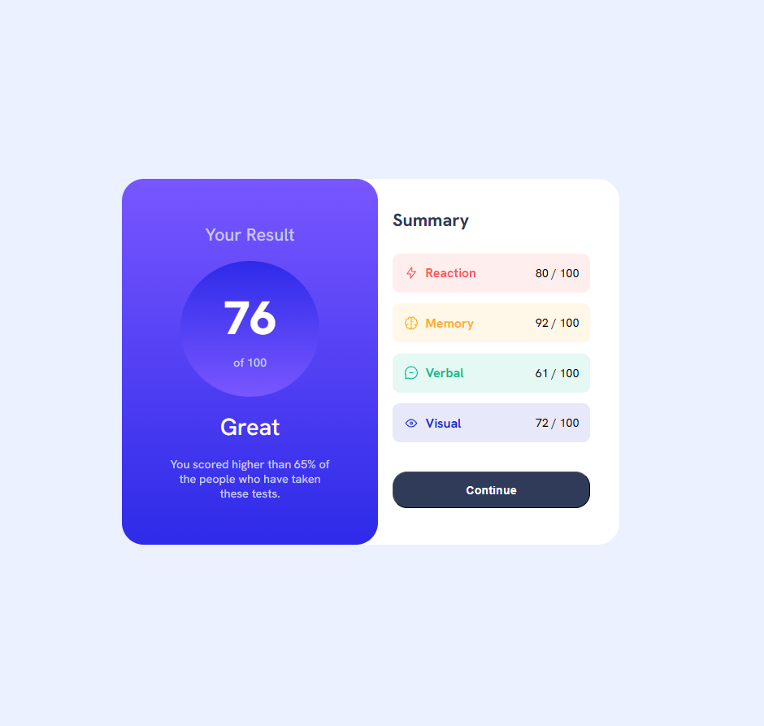

# Results Summary Component

 
## Description

This project is an implementation of the "Results Summary Component" challenge from Frontend Mentor. The goal is to create a visually appealing results summary component using HTML and CSS.

## Features

- Clear and concise display of results.
- Interactive elements, such as buttons with hover effects.
- Responsive design for different screen sizes, especially for mobile devices (375px resolution).

## Technologies Used

- HTML
- CSS (Flexbox and Media Queries)

## How to Run

1. Clone the repository or download the files.
2. Open the `index.html` file in a browser.
3. You will see the results summary component rendered on the screen.

## Learnings

- **HTML and CSS**: Improved my skills in HTML and CSS, particularly in organizing and structuring elements.
- **Responsiveness**: Learned to create responsive layouts using Flexbox and media queries, ensuring the design works well on devices of various sizes.
- **Element Positioning**: Gained a better understanding of using `z-index` to control the overlap of elements and how it can affect the visual hierarchy of the layout.
- **Visual Organization**: Separating elements using divs helped enhance code clarity and maintainability, allowing for a cleaner and more understandable structure.

## Author

[Your Name] - [Your LinkedIn or Portfolio] (optional)

## License

This project is licensed under the [MIT License](LICENSE).